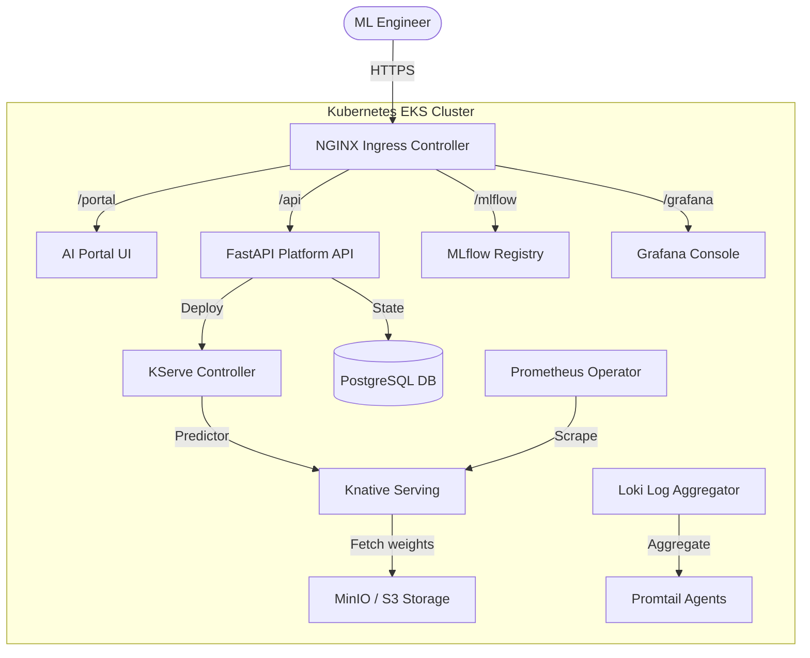
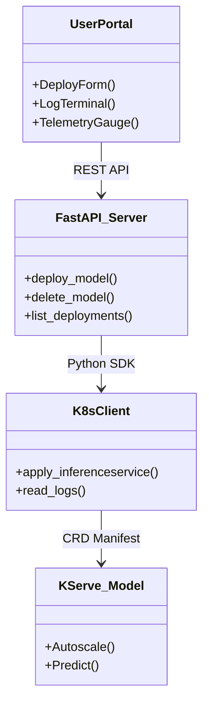
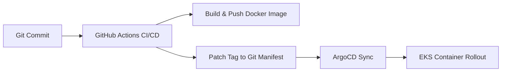
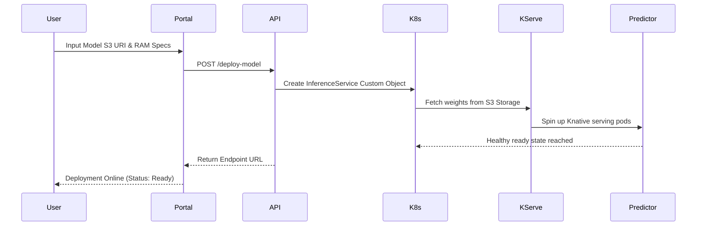

# Kubernetes AI Infrastructure Platform

[](#)
[](#)
[](#)
[](#)
[](#)
[](#)
[](#)
[](#)
[](#)
[](#)
[](#)
[](#)

A production-grade, self-service AI Model Serving and Platform engineering implementation built on Kubernetes. The platform resembles AWS SageMaker, Vertex AI, Databricks Model Serving, and internal OpenAI platforms.

---

## 📖 Complete Documentation Index

For detailed guides and engineering specifications, refer to:
*   **High-Level Design**: Learn about architecture topologies and component layouts in [docs/HLD.md](file:///d:/Ai%20infra%20&%20ai%20plateform/Kubernetes%20AI%20Infrastructure%20Platform/docs/HLD.md).
*   **Low-Level Design**: Examine directory trees, API definitions, and DB schemas in [docs/LLD.md](file:///d:/Ai%20infra%20&%20ai%20plateform/Kubernetes%20AI%20Infrastructure%20Platform/docs/LLD.md).
*   **Detailed Architecture Specs**: Learn the role, alternatives, and best practices of each tool in [docs/ARCHITECTURE.md](file:///d:/Ai%20infra%20&%20ai%20plateform/Kubernetes%20AI%20Infrastructure%20Platform/docs/ARCHITECTURE.md).
*   **Business Use Cases**: Review ROI, pain points, and enterprise examples in [docs/BUSINESS_USE_CASES.md](file:///d:/Ai%20infra%20&%20ai%20plateform/Kubernetes%20AI%20Infrastructure%20Platform/docs/BUSINESS_USE_CASES.md).
*   **Local Installation Guide**: Set up virtual environments, database seeding, and tests locally in [docs/INSTALLATION.md](file:///d:/Ai%20infra%20&%20ai%20plateform/Kubernetes%20AI%20Infrastructure%20Platform/docs/INSTALLATION.md).
*   **Cloud & GitOps Deployment**: Configure AWS, build Docker containers, and sync with ArgoCD in [docs/DEPLOYMENT.md](file:///d:/Ai%20infra%20&%20ai%20plateform/Kubernetes%20AI%20Infrastructure%20Platform/docs/DEPLOYMENT.md).
*   **Troubleshooting Playbooks**: Diagnose common EKS, Terraform, and KServe failures in [docs/TROUBLESHOOTING.md](file:///d:/Ai%20infra%20&%20ai%20plateform/Kubernetes%20AI%20Infrastructure%20Platform/docs/TROUBLESHOOTING.md).
*   **Security Architecture Specs**: Understand Network Policies, Keycloak SSO, and AWS IRSA in [docs/SECURITY.md](file:///d:/Ai%20infra%20&%20ai%20plateform/Kubernetes%20AI%20Infrastructure%20Platform/docs/SECURITY.md).
*   **Platform Lifecycles**: Learn about DevOps CI/CD pipelines, MLOps, and developer journeys in [docs/OPERATIONS.md](file:///d:/Ai%20infra%20&%20ai%20plateform/Kubernetes%20AI%20Infrastructure%20Platform/docs/OPERATIONS.md).
*   **Operator Runbook**: onboarding teams, port-forwarding to metrics, and node pool scaling in [docs/RUNBOOK.md](file:///d:/Ai%20infra%20&%20ai%20plateform/Kubernetes%20AI%20Infrastructure%20Platform/docs/RUNBOOK.md).

---

## 🎯 Project Overview

This platform provides data scientists and ML engineers with a **self-service model deployment** mechanism on AWS EKS, utilizing **KServe** for serverless inference (scale-to-zero), **MLflow** for version tracking, **ArgoCD GitOps** for continuous delivery, and a centralized **Prometheus/Grafana/Loki** observability stack. It addresses the overhead of manual container packaging and cloud infrastructure management.

---

## 💼 Business Problems Solved

### Problem 1: Deployment Latency (Weeks to Minutes)
*   **Context**: AI teams take weeks to deploy trained model weights due to manual container packaging, routing configurations, and firewall requests.
*   **Solution**: Self-Service Serving Portal allows engineers to input model S3 URIs and spin up a Knative serving pod in minutes.

### Problem 2: Deployment Inconsistency
*   **Context**: Lack of standard serving engines leads to custom Flask wrappers deployed ad-hoc.
*   **Solution**: GitOps-based declarative application state synced continuously via ArgoCD.

### Problem 3: Missing Model Lineage
*   **Context**: Hard to trace which code and parameters generated which model weights in production.
*   **Solution**: Centralized MLflow Model Registry tracking metadata and links to versioned S3 weights.

### Problem 4: Operational Blindspots
*   **Context**: Errors and performance drops are noticed only when customers complain.
*   **Solution**: Integrated Prometheus metric alerts (e.g. latency warnings) and Loki centralized logs.

### Problem 5: Manual Cloud Management
*   **Context**: Manual creation of EKS clusters, NAT gateways, and IAM roles leads to configuration drift.
*   **Solution**: 100% Infrastructure as Code (IaC) automation via Terraform modules.

### Problem 6: Resource Overlapping & Security Risks
*   **Context**: Multiple teams sharing the same cluster interfere with each other's pods and data.
*   **Solution**: Multi-tenant isolation using Kubernetes Namespaces, RBAC, and egress NetworkPolicies.

### Solution Matrix

| Tool | Business Problem Solved |
| :--- | :--- |
| **Terraform** | Automates multi-environment AWS infrastructure deployment, eliminating drift and configuration errors. |
| **Kubernetes** | Handles container orchestration, high-availability, rolling rollouts, and scheduling. |
| **ArgoCD** | Automates GitOps, syncing resource manifests directly from Git to prevent manual drift. |
| **MLflow** | Unifies experiment runs and coordinates model promotions from dev to production. |
| **KServe** | Automates serverless inference, scaling-to-zero, GPU allocations, and metrics exposure. |
| **Prometheus** | Performs scraping and storage of time-series metric data. |
| **Grafana** | Visualizes cluster resource utilization and model performance metrics. |
| **Loki** | Aggregates and searches cluster logs without expensive index overhead. |
| **Keycloak** | Implements standard OAuth2/OIDC Single-Sign-On (SSO) and client authentication. |
| **PostgreSQL** | Stores platform state metadata, audit history, and user workspace definitions. |

---

## 🏗️ High-Level Design

### Architecture Diagram



### Component Diagram



### Deployment Flow



### Data Flow Diagram



---

## 🛠️ Tool Specifications & Alternatives

### AWS (Amazon Web Services)
*   **What is it**: Secure cloud computing environment.
*   **Why is it used**: Houses core networking and server clusters.
*   **Business Problem Solved**: Replaces expensive on-premise data centers with scalable, SLA-backed compute resources.
*   **Role in Architecture**: Hosting EKS, S3 model stores, and VPC private subnets.
*   **Enterprise Use Cases**: Netflix, Airbnb, and Spotify run main application servers on AWS.
*   **Alternatives**: Microsoft Azure, Google Cloud Platform (GCP).

### Terraform
*   **What is it**: Infrastructure as Code (IaC) tool.
*   **Why is it used**: Captures and provisions infrastructure declaratively.
*   **Business Problem Solved**: Avoids configuration drift and mistakes associated with manual console clicking.
*   **Role in Architecture**: Automates EKS, VPC, and IAM role deployment.
*   **Enterprise Use Cases**: Uber, Slack, and HashiCorp manage global environments via Terraform.
*   **Alternatives**: AWS CloudFormation, Pulumi.

### AWS EKS (Elastic Kubernetes Service)
*   **What is it**: Managed container orchestration service.
*   **Why is it used**: Standardizes scheduling, networking, and scaling.
*   **Business Problem Solved**: Eliminates the high maintenance costs of managing Kubernetes control planes.
*   **Role in Architecture**: Manages model serving and application containers.
*   **Enterprise Use Cases**: Intel, Autodesk, and GoDaddy deploy platform pods on EKS.
*   **Alternatives**: Red Hat OpenShift, self-managed Kubernetes.

*(Additional components including Kubernetes, ArgoCD, GitHub Actions, MLflow, KServe, MinIO, PostgreSQL, FastAPI, Prometheus, Grafana, Loki, and Keycloak are fully documented in [docs/ARCHITECTURE.md](file:///d:/Ai%20infra%20&%20ai%20plateform/Kubernetes%20AI%20Infrastructure%20Platform/docs/ARCHITECTURE.md)).*

---

## 📂 Repository structure

```text
kubernetes-ai-infrastructure-platform/
├── terraform/             # AWS VPC, EKS, and IAM Role modules
├── kubernetes/            # Namespace, RBAC, Ingress, HPAs, and NetworkPolicies
├── argocd/                # ArgoCD App-of-Apps GitOps specifications
├── monitoring/            # Prometheus scrape rules, Grafana dashboards, Loki configs
├── mlflow/                # MLflow tracking deployment manifests
├── kserve/                # KServe gateway configurations and sample model manifests
├── minio/                 # S3-compatible StatefulSet persistent storage
├── fastapi-platform-api/  # FastAPI platform API codebase, Dockerfile, and Portal UI
├── scripts/               # Automation setup, deploy, destroy, and backup scripts
└── docs/                  # Detailed design and operational documentations
```

---

## 🚀 How to Run the Application

### 1. Local Development
```bash
git clone https://github.com/bittush8789/kubernetes-ai-infrastructure-platform.git
cd kubernetes-ai-infrastructure-platform
python -m venv venv
# Linux/macOS:
source venv/bin/activate
# Windows (PowerShell):
.\venv\Scripts\Activate.ps1

pip install -r fastapi-platform-api/requirements.txt
cd fastapi-platform-api
python -m uvicorn app.main:app --reload
```
Open [http://localhost:8000/portal/](http://localhost:8000/portal/) to access the dashboard.

### 2. Docker
```bash
docker build -t ai-platform -f fastapi-platform-api/Dockerfile fastapi-platform-api/
docker run -d -p 8000:8000 ai-platform
```

### 3. Docker Compose
```bash
docker-compose up -d
```

### 4. Terraform
```bash
cd terraform
terraform init
terraform plan
terraform apply -auto-approve
```

### 5. Kubernetes
```bash
kubectl apply -f kubernetes/namespaces/namespaces.yaml
kubectl apply -f kubernetes/rbac/roles.yaml
kubectl apply -f kubernetes/ingress/nginx-ingress.yaml
kubectl apply -f kubernetes/hpa/hpa-template.yaml
```

### 6. ArgoCD
```bash
kubectl apply -f argocd/root-application.yaml
```

### 7. Verify Deployment
```bash
kubectl get pods -A
kubectl get svc -A
kubectl get ingress -A
```

---

## 📜 Scripts Documentation

*   [setup.sh](file:///d:/Ai%20infra%20&%20ai%20plateform/Kubernetes%20AI%20Infrastructure%20Platform/scripts/setup.sh): Verifies dependency CLI tools (Terraform, Docker, Helm), creates Python virtualenv, and generates local database configurations.
*   [deploy.sh](file:///d:/Ai%20infra%20&%20ai%20plateform/Kubernetes%20AI%20Infrastructure%20Platform/scripts/deploy.sh): Boots AWS resources via Terraform, configures EKS context, and bootstraps ArgoCD.
*   [destroy.sh](file:///d:/Ai%20infra%20&%20ai%20plateform/Kubernetes%20AI%20Infrastructure%20Platform/scripts/destroy.sh): Safe deletion of namespaces and AWS resources.
*   [backup.sh](file:///d:/Ai%20infra%20&%20ai%20plateform/Kubernetes%20AI%20Infrastructure%20Platform/scripts/backup.sh): Dumps PostgreSQL/SQLite metadata and copies MinIO model files to YYYY-MM-DD zip files.
*   [monitor.sh](file:///d:/Ai%20infra%20&%20ai%20plateform/Kubernetes%20AI%20Infrastructure%20Platform/scripts/monitor.sh): Verifies cluster node connectivity and highlights unhealthy pods.

---

## 🗺️ Project Roadmap
-   **Phase 1**: Core inference serving and GitOps pipelines (Completed).
-   **Phase 2**: Keycloak SSO integration with the Portal frontend client (In Progress).
-   **Phase 3**: Custom Kafka-based autoscaling metrics (Roadmap).

## 📄 License
Licensed under the MIT License.
