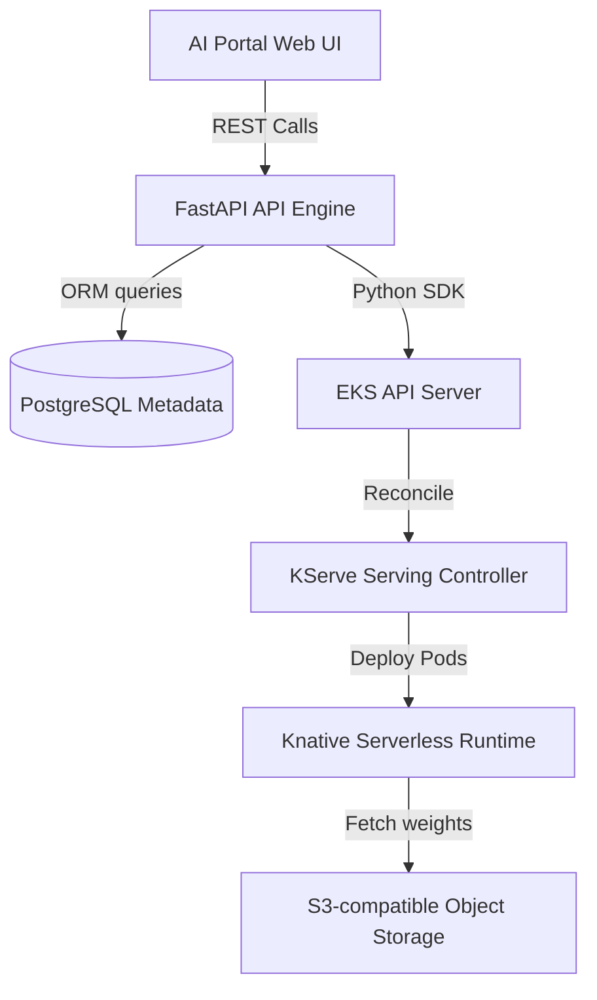
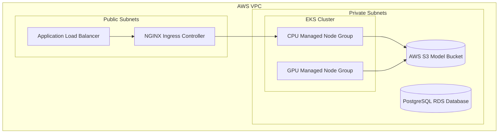
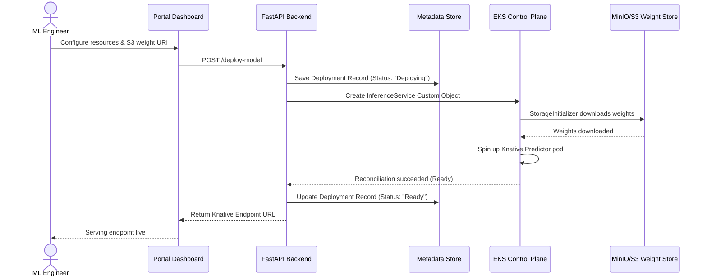

# High-Level Design (HLD)

This document specifies the high-level system architecture, design topologies, and operational resilience strategies.

---

## 1. Executive Summary
Enterprise AI platform engineering faces high bottlenecks when data scientists attempt to serve registered models into production. Manual configurations, slow pipeline rollouts, and lack of system visibility delay model release cycles. 
This platform delivers a **Production-Grade, Self-Service Model Serving and Platform Environment** on Kubernetes. By orchestrating KServe serverless execution, ArgoCD GitOps pipelines, and Prometheus monitoring stacks, it reduces deployment latencies from weeks to under five minutes, raising container compute utilization and securing tenant namespaces under strict governance rules.

---

## 2. Architecture Overview
The platform exposes a single-endpoint user portal UI that handles REST commands. This front-facing API acts as an orchestrator, translating user CPU/RAM/GPU request specs into Kubernetes Custom Resources (`InferenceServices`) applied directly to an AWS EKS cluster. The EKS cluster processes container lifecycles, pulling model weights from S3/MinIO, and routes traffic dynamically via Knative/Istio ingress gates.

```text
ML Engineer ──> Portal UI ──> FastAPI Server ──> Kubernetes API ──> KServe (EKS) ──> Model Pods
```

---

## 3. Architecture Diagrams

### Component Diagram



### Deployment Diagram



### Data Flow Diagram



---

## 4. Security Architecture
The platform enforces security gates across network, identity, and storage layers:
-   **Namespace Isolation**: Teams run in distinct namespaces (`team-a`, `team-b`, `team-c`) constrained by NetworkPolicies that block cross-namespace ingress traffic.
-   **SSO & Role Control**: Keycloak SSO controls access. Tokens are verified using JWT validators, mapping users to `admin`, `ml-engineer`, or `viewer` roles.
-   **AWS OIDC Federation (IRSA)**: EKS ServiceAccounts are mapped dynamically to AWS IAM Roles, granting pods S3 read/write access without distributing static credentials.
-   **Secrets Encryption**: etcd secrets are encrypted at rest using AWS KMS envelope keys. TLS encryption in transit is managed via cert-manager.

---

## 5. Monitoring Architecture
Observability is built on a Prometheus, Grafana, and Loki stack:
-   **Metric Scraping**: Prometheus pulls container stats, cluster load metrics, and KServe inference latencies (port `9080`).
-   **Alert Routing**: Alertmanager triggers warning alerts for high P95 model latency (>500ms) or pod restart loops.
-   **Log Aggregation**: Promtail captures container standard streams (stdout/stderr) and ships logs to Loki for indexing.

---

## 6. Scalability Design
The serving plane scales dynamically to prevent compute starvation and lower idle costs:
-   **Scale to Zero**: Knative pods automatically scale down to 0 replicas if no HTTP queries are received for 5 minutes.
-   **Concurrency-based Scaling**: Pod scaling decisions are based on request concurrency metrics (target: 10 concurrent requests per pod) rather than CPU limits, allowing rapid response to spikes.
-   **Autoscaling Node Pools**: EKS Cluster Autoscaler adds EC2 nodes to Node Groups when pods remain `Pending` due to lack of CPU/GPU resources.

---

## 7. High Availability Design
-   **Multi-AZ Topology**: Managed node pools are deployed across 3 AWS Availability Zones (AZs).
-   **Replica Sets**: Core platform APIs and Keycloak run with a minimum of 2 replicas, scheduled across different nodes using pod anti-affinity.
-   **Database Redundancy**: PostgreSQL runs in Multi-AZ configuration with automated read-replicas.

---

## 8. Disaster Recovery Strategy
The platform implements an **Active-Passive Disaster Recovery** strategy with a Recovery Time Objective (RTO) of 30 minutes and Recovery Point Objective (RPO) of 4 hours:
-   **State Backups**: PostgreSQL database dumps are archived hourly. MLflow model registry buckets are backed up using AWS S3 cross-region replication (CRR).
-   **IaC Re-provisioning**: If a primary region fails, the infrastructure is re-created in the secondary region using Terraform commands.
-   **GitOps Workload Restoration**: ArgoCD is installed in the new cluster and syncs the root application, restoring all cluster applications to their last known good state from Git.
