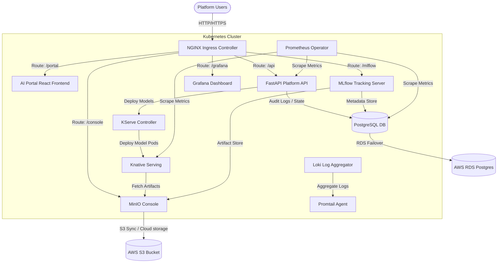
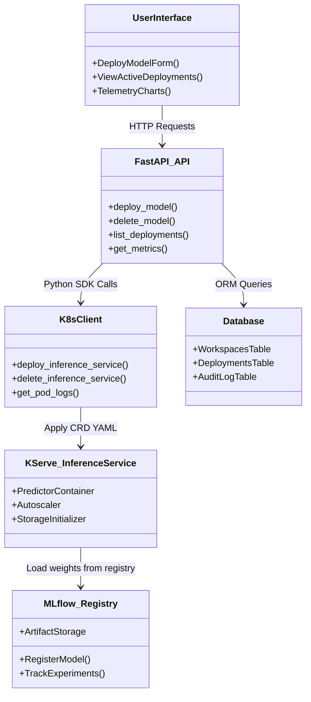
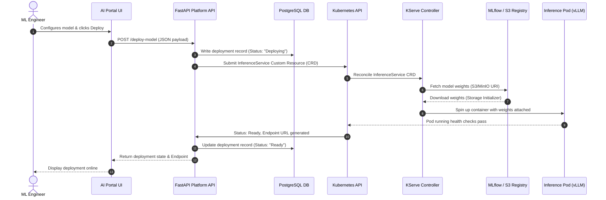
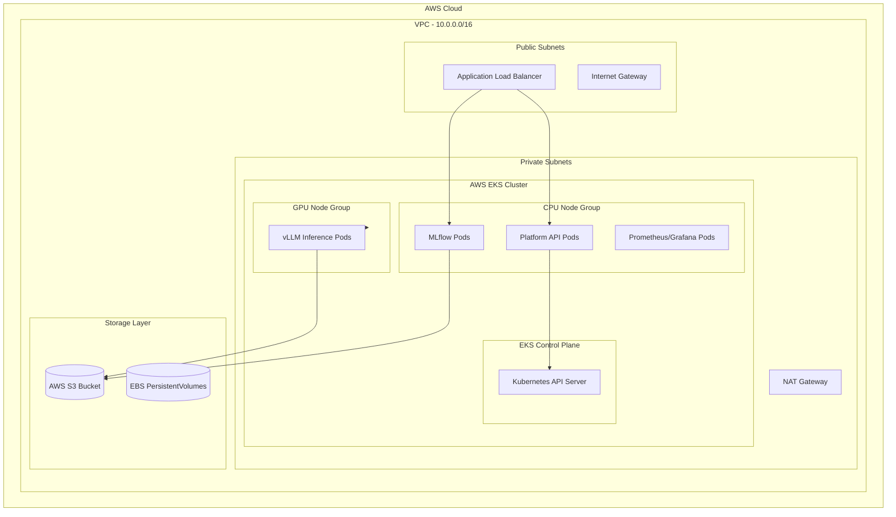

# High-Level Design (HLD)

This document provides the high-level design of the Enterprise Kubernetes AI Infrastructure Platform.

---

## 1. System Diagrams

### High-Level Architecture (HLD)

### Component Diagram

### Data Flow Diagram (Model Deployment & Serving)

### Deployment Diagram (AWS EKS Topology)

---

## 2. Platform Component Business Analysis

| Tool | Business Problem Solved |
|:---|:---|
| **Terraform** | Automates multi-environment AWS infrastructure deployment, eliminating drift and configuration errors. |
| **AWS VPC** | Secures network infrastructure by isolating internal pods from public interfaces. |
| **AWS IAM / IRSA** | Prevents credential leaks by mapping EKS ServiceAccounts directly to AWS IAM roles. |
| **AWS EKS** | Replaces complex Kubernetes control plane operations with a managed, SLA-backed container service. |
| **AWS S3** | Supplies high-durability, cost-efficient storage for terabyte-scale ML models and checkpoints. |
| **AWS EBS** | Provides dynamic, high-IOPS block storage for databases and persistent tools. |
| **Kubernetes** | Handles container orchestration, high-availability, rolling rollouts, and scheduling. |
| **Pods / Deployments** | Packs software applications into immutable, isolated runtimes. |
| **Services & Ingress** | Exposes cluster pods internally and externally via load-balancing and domain-based routing. |
| **HPA** | Scales serving resources dynamically during spikes to protect availability and reduce idle costs. |
| **Namespaces** | Partitions the cluster into logic environments for multi-tenancy workspace isolation. |
| **RBAC** | Restricts human and machine access based on least-privilege principles. |
| **Network Policies** | Prevents lateral network movement between tenant workloads (Security Isolation). |
| **GitHub Actions** | Drives CI pipelines (automated linting, image building, testing). |
| **ArgoCD** | Automates GitOps, syncing resource manifests directly from Git to prevent manual drift. |
| **MLflow** | Unifies experiment runs and coordinates model promotions from dev to production. |
| **KServe** | Automates serverless inference, scaling-to-zero, GPU allocations, and metrics exposure. |
| **MinIO** | Implements local S3-compatible endpoints for development, testing, and latency reduction. |
| **FastAPI** | Serves as the self-service abstraction API layer for platform users. |
| **PostgreSQL** | Stores platform state metadata, audit history, and user workspace definitions. |
| **Prometheus** | Performs scraping and storage of time-series metric data. |
| **Grafana** | Visualizes cluster resource utilization and model performance metrics. |
| **Loki & Promtail** | Aggregates and searches cluster logs without expensive index overhead. |
| **Keycloak** | Implements standard OAuth2/OIDC Single-Sign-On (SSO) and client authentication. |

---

## 3. Alternative Solutions Analysis

### MLflow Alternatives
- **Weights & Biases (W&B)**: Enterprise SaaS with rich visualization. Chosen MLflow because it is fully open-source, easily self-hosted in-cluster, and supports direct S3-compatible backend storage without third-party cloud lock-in.
- **Comet ML**: Commercial option focusing on team sharing. Not used due to pricing models and lack of deep integration with Knative/KServe ecosystems.

### KServe Alternatives
- **Seldon Core**: Advanced inference framework. Chosen KServe because it is the CNCF standard, has native support for Knative Serverless scale-to-zero, and aligns closely with Kubeflow.
- **Triton Server**: High-performance engine. Triton is actually used *inside* KServe as a predictor runtime rather than an alternative.

### Prometheus Alternatives
- **Datadog**: High-cost commercial agent. Not used because Prometheus is standard on Kubernetes, free to scale, and integrates out of the box with EKS metrics collectors.
